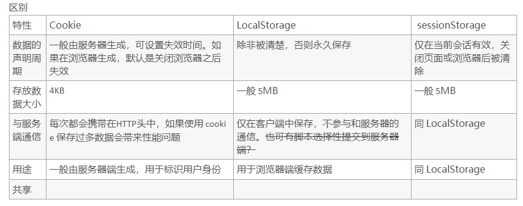

## 临毕业摸底测验（第一部分）
@(201802)

### JavaScript （前端玩家必备技能）
1. ele.getAttribute('propName') 和 ele.propName区别

```
ele.getAttribute()，是标准DOM操作文档元素属性的方法，具有通用性可在任意文档上使用，返回元素在源文件中设置的属性
   ele.getpropName 通常是在HTML文档中访问特定元素的特性，浏览器解析元素后生产对应对象，这些对象的特性会根据特定规则结合属性设置得到，对于没有对应特性的属性只能使用getAttribute进行访问
返回值：ele.getAttribute()返回值是源文件中设置的值，类型是字符串或者null

        ele.propName返回值可能是字符串、布尔值、对象、undefined等
        大部分attribute与property是一一对应关系、修改其中一个会影响另一个，如id、title等属性
	一些布尔属性<input hidden/>的检测设置需要hasAttribute和removeAttribute来完成、或者设置对应property
        一些attribute和property不是一一对应如：form控件中<input value="hello"/>对应的是defaultValue、修改或设置value property修改的是控件当前值、setAttribute修改value属性不会改变value property
        
```
题目借鉴地址：https://funteas.com/topic/5906ab598783c1370b809c45


------

2. mouseover和mouseenter的区别

```
只要划入mouseover的子级或者父级元素都会触发执行mouseover，而mouseenter只有经过mouseenter元素才会触发
```

------

3. 什么是事件代理

```
在当前事件的祖先元素身上绑定 事件方法，这就不会因为冒泡传播机制多次触发改事件方法
```

------

4. localStorage和cookie的区别，cookie和session的关系！

```
基本概念：

Cookie：指某些网站为了辨别用户身份而存储在用户本地终端上的数据。
分类
内存 Cookie
由浏览器维护，保存在内存中，浏览器关闭就小时，存在时间短暂。

硬盘 Cookie
保存在硬盘中，除非用户手工清理或到了过期时间，一般不会删除。

用途
服务器可以设置或读取 Cookies 中包含的信息，借此维护用户跟服务器会话中的状态
因为 HTTP 协议是无状态的，就是说服务器不知道用户上一次做了什么，为实现交互，就用 Cookie 来记录。

比如，网上购物，用户选购了一个商品，服务器在向用户发送网页时还发送一段记录商品信息的 Cookie，当用户访问另一个页面，浏览器会把 Cookie 发送给服务器端，于是服务器就知道用户选购了什么。

登录网站勾选“下次自动登录”，那么下次访问就不用再输入密码等信息。
这是因为在第一次登录时，如果勾选了自动登录，那么服务器发送包含登录凭据（用户加密码的某种加密形式）的 Cookie 到用户的硬盘上，第二次登录的时候，浏览器就会发送该 Cookie，服务器验证凭据，就不用再次输入密码等。

缺陷
Cookie 会被附加到每个 HTTP 请求中，无形增加了流量
HTTP请求中的 Cookie 是明文传递，安全性成问题。（HTTPS 不会）
Cookie 大小限制在 4KB，对于复杂的存储需求是不够用的
LocalStorage
Web Storage 有两种机制
sessionStorage 为每一个给定的源维持一个独立的存储区域，该存储区域在页面会话期间可用（浏览器是打开状态，包括页面重载和恢复）
localStorage 同上，但浏览器关闭之后，重新打开数据还是存在。
```


借鉴地址：https://blog.csdn.net/lttxzmj/article/details/61921551

------

5. 什么是闭包，你在项目中哪一块用到了闭包！

```
闭包的主要作用就是对代码的保存和保存；
防止全局变量名的冲突和污染，以前项目当中都会用到闭包，比如开发当中用到的单例模式和高级单例模式；还有对一个方法的我们会用闭包进行封装
```

------

6. js中定义函数的方式有哪些，区别是什么！

```
JS中的函数定义有三种：
函数声明 
function fn1(){}

函数表达式，又叫函数字面量
let fn2 = function fn2(){}

俩者的区别：解析器会先读取函数声明，并使其在执行任何代码之前可以访问；而函数表达式则必须等到解析器执行到它所在的代码行才会真正被解析执行


函数构造，参数必须加引号
let fn3 = new Function('n1','n2','return n1+n2'){}

这是一个函数表达式。一般不推荐用这种方法定义函数，因为这种语法会导致解析两次代码（第一次是解析常规ECMAScript代码，第二次是解析传入构造函数中的字符串），从而影响性能。

Function()构造函数每次执行时都会解析函数主体，并创建一个新的函数对象，所以当在一个循环或频繁执行的函数中调用Function()构造函数效率是非常低的。而函数字面量却不是每次遇到都会重新编译的，用Function()构造函数创建一个函数时并不遵循典型的作用域，它一直把它当作是顶级函数来执行。

```
借鉴地址：https://www.jb51.net/article/80861.htm

-------


7. 说出你掌握的继承方式及优缺点，并加以改进！

```
原型继承
	1、方式：子类的原型指向父类的实例  父类的实例本身就具备私有的属性和方法，子类的原型指向它，那么子类的实例就可以找到这些属性方法了
	2、和传统后台语言的继承不一样，子类继承父类并不是把父类的属性方法克隆一份副本给子类，这样处理子类和父类就没有这些关系了，JS中的原型继承是让子类和父类建立原型连接的机制，子类的实例调取父类原型上的方法都是基于原型链机制完成的。
	存在的问题：子类可以重写父类原型上的方法，子类和父类还有关系的。
原型继承存在的问题：
	1父类实例私有的属性以及公有的属性都变为子类实例的公有的属性
	2如果子类的原型上之前有属性方法，重新指向父类的子类后，之前的方法都没有了。
2）call 继承
	把A作为类创建它的实例
	把父类A作为普通函数执行，让A中的this变为B的实例，相当于给B的实例增加一些属性和方法。(弊端:把父类A当做普通函数执行，和原型A没啥关系了，仅仅是把A中的私有属性变为子类B实例的私有属性而已，A原型上的公有属性和方法和B的实例没啥关系)
3）寄生组合继承：
	A的私有变为B的私有，A的公有变为B的公有。
	基于call的继承把A的私有变为B的私有
	Object.creater
    内置object类天生自带的方法
    1创建一个空对象
    2让新创建的空对象的 _ _ proto _ _ 指向第一个传递的对象，作为新创建空对象的原型
和原型继承的区别
    B.prototype=new A();创建的A的实例虽然指向A的原型，但是实例中的不是空的，存放了A的私有属性，这些属性变为B的公有属性
    B.prototype=Object.creater(A.prototype);好处在于我们创建了一个没有私有属性和方法空对象，指向A的原型，这样B的共有就不会有A的私有属性和方法
4）ES6中的类和继承
    ES6中创建类是有自己标准语法的(这种语法创建的类只能new执行，不能当普通函数执行)
  static AA(){} //把FN当做一个普通对象设置的私有方法(和实例没有关系)，但是也只能写方法不能写属性。


```


-----

8. 说出ES6和ES5的区别！

```
相比于ES5,ES6取消了很多没有的设定比如变量提升，重复声明、等问题，
ES6还添加了很多的新属性和类
比如 
方法：fliter forEach map find findIndex errove等
类：Map set promise proxy等类  还有一个基础类 Symbol
```


-----

9. 阐述JS中的同步编程和异步编程，以及你在项目中是如何来使用异步操作的！

```
JS是单线程的代码从上倒下 它一次只能执行一次事情，所以我们都会说JS是单线程语言，
然而因为开发需求一次只能执行一次任务不能满足项目需求了，所以异步编程就出来了，很多人都说异步编程就是病态的多线程，我认为不是，因为所谓的异步编程还是单线程的只是多出来一个容器，这个容器里放着异步的任务，但是执行还是在主线程里执行。

```

----

10. 实现一个Promise

### HTTP && AJAX && 跨域 （18+玩家必备技能，初级玩家需要了解一些的）
1. 写出项目中经常用到的性能优化方案

```
一般项目中性能优化都是在对DOM操作和HTTP请求次数上做优化，以及少部分其他地方的优化
采用CSS雪碧图，
CSS合并成一个，JS也最好合并成一个
首先同过一些工具（例如：webpack）把合并后的CSS或者JS压缩成 xxx.min.js，减少文件大小
服务器端开启资源文件的GZIP压缩

采用图片懒加载技术
对于不经常更新的数据，最好采用浏览器的304缓存做处理

除了减少HTTP请求次数和大小可以优化性能，我们在编写代码的时候，也可以进行一些优化，让页面的性能有所提升

在做DOM事件绑定的时候，尽量避免一个个的事件绑定，而是采用性能更高的事件委托来实现

采用CDN加速
CDN：分布式（地域分布式）
```


2. 从浏览器地址栏输入URL到显示页面，中间都经历了什么（尽可能写详细，最好回答出TCP的三次握手和四次挥手，以及浏览器加载页面的细节）

```
通过url去访问cmd域名服务器，在反解析获取到服务器的IP地址，访问服务器通过端口号访问对应的项目文件，获取到项目文件，在进行DOM和CSS树的渲染，通过cpu进行页面的渲染
```

-----

3. 说出你所熟知的HTTP状态码！GET和POST有啥区别！
```
 HTTP网络状态码：记录了当前服务器返回信息的状态 xhr.status
 200：成功，一个完整的HTTP事务完成（以2开头的状态码一般都是成功）
  
 以3开头一般也是成功，只不过服务器端做了很多特殊的处理
 301：Moved Permanently  永久转移（永久重定向）`一般应用于域名迁移`
 302：Move temporarily 临时转移（临时重定向，新的HTTP版本中任务307是临时重定向）`一般用于服务器的负载均衡：当前服务器处理不了，我把当前请求临时交给其他的服务器处理（一般图片请求经常出现302，很多公司都有单独的图片服务器）`
 304：Not Modified 从浏览器缓存中获取数据 `把一些不经常更新的文件或者内容缓存到浏览器中，下一次从缓存中获取，减轻服务器压力，也提高页面加载速度`
  
 以4开头的，一般都是失败，而且客户端的问题偏大
 400：请求参数错误
 401：无权限访问
 404：访问地址不存在
  
以5开头的，一般都是失败，而且服务器的问题偏大
500：Internal Server Error 未知的服务器错误
503：Service Unavailable 服务器超负载


get和post最大的区别在于传输的地方不同，get是通过url路径传输的，post是通过请求主体传输的，这个区别就会出现下面三个的区别

	GET请求传递给服务器的内容一般没有POST请求传递给服务器的内容多
 原因：GET请求传递给服务器内容一般都是基于`url地址问号传递参数`来实现的，而POST请求一般都是基于`设置请求主体`来实现的。
 各浏览器都有自己的关于URL最大长度的限制（谷歌：8KB、火狐：7KB、IE：2KB...）超过限制长度的部分，浏览器会自动截取掉，导致传递给服务器的数据缺失。
 理论上POST请求通过请求主体传递是没有大小限制的，真实项目中为了保证传输的速率，我们也会限制大小（例如：上传的资料或者图片我们会做大小的限制）

	GET请求很容易出现缓存（这个缓存不可控：一般我们都不需要），而POST不会出现缓存（除非自己做特殊处理）；
 原因：GET是通过URL问号传参传递给服务器信息，而POST是设置请求主体；
 设置请求主体不会出现缓存，但是URL传递参数就会了。

GET请求没有POST请求安全（POST也并不是十分安全，只是相对安全）
 原因：还是因为GET是URL传参给服务器
 有一种比较简单的黑客技术：URL劫持，也就是可以把客户端传递给服务器的数据劫持掉，导致信息泄露
```

-----

4. 什么是HTTP报文，你熟知的报文都有哪些！

```
在客户端向服务器发送请求，以及服务器把内容响应给客户端的时候，中间相互传递了很多内容(客户端把很多内容传递给服务器，服务器把一些内容响应给客户端)，我们把传递的内容统称为"HTTP报文";

回忆如风逝去的日子 2018/6/16 星期六 21:56:38

```

-----

5. 能说下304具体怎样实现吗？
6. 跨域是什么？http协议中如何判断跨域？如何解决跨域问题？
7. HTTP2具体内容？SDPY了解么？
8. HTTPS如何实现？tsl/ssl是什么？对称加密、非对称加密在什么时候、对什么数据加密？
9. DNS劫持是什么？
```
DNS劫持又称域名劫持,是指通过某些手段取得某域名的解析控制权，修改此域名的解析结果，导致对该域名的访问由原IP地址转入到修改后的指定IP，其结果就是对特定的网址不能访问或访问的是假网址。DNS劫持是一种黑客技术，通过这种域名欺诈达到投放病毒，骗取用户相关资料或入侵他人电脑的目的
```

----

10. 封装一个AJAX库！
